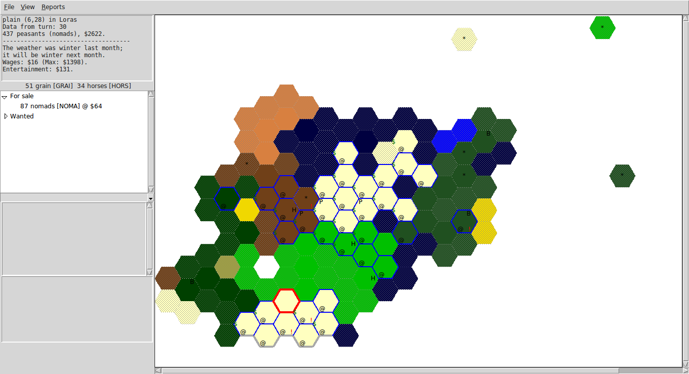

# Tcl GUI for Atlantis PBEM

Requires [Tcl](https://www.tcl.tk/)

The Tcl package requirements are fairly minimal (any "batteries included" installation should have them)
* Wish (the GUI component)
* Itcl (object oriented extension)
* sqlite (database)

If everything is set up correctly, you should be able to just load "client.tcl" into your wish executable (on UNIX 'wish client.tcl', on Windows, double-click client.tcl or open wish and source it).

On some stock Linux machines you might need the package libsqlite3-tcl (`apt-get install libsqlite3-tcl`)
And itcl3 (`apt-get install itcl3`)

# Starting a new game
All your turn history is stored in a database. You'll want a database for each game of Atlantis you play.

From the File menu, select "New", I like to make a new directory with the database, turn files, order files, and any notes I'm making. Whatever you do, pick a name for the database file. I like to end them with .db so they stick out.

# Loading an existing game
If you already have a database, use File->Open to bring it back.

# Adding turn information
When you get a new turn, use File->Add Report to load it into the databse. You only need to do it once. The database will remember it.

# Navigating and Creating orders
The map will automatically be updated with any new information. Use View->Mark Active hexes to highlight (in blue) the hexes where you have units.

In the active hex (marked in red), the units present will be shown on the left. Enter their orders in the bottom text area. When you move away, the orders will be saved internally. When you are done with a hex, hit 'd' to remove the highlight. When all the hexes are done, use Reports->Idle Units to find any units that missed getting orders.

You can move to a hex by clicking on it, or by pressing the direction keys (arrows and Home/End/PgDn/PgUp). Also, double clicking a unit in a report should make that unit's hex active (if I've gotten around to enabling it :)

When done, use File->Save Orders to export all your orders into a file suitable for sending back to the server.

# Other keyboard commands
* c - center map (also, double click)
* d - done with hex (clear blue highlight)
* n - form new unit
* s - split current unit
* arrow keys for navigation (left and right will try to keep you in a straight line, Home/End/PgUp/PgDn allow you to move diagonally)
* +/- zoom in, zoom out

# Right-click
* level up and down (Nexus is level 0, main map is level 1, first underworld is level 2, etc)
* center map
* calculate maximum number of taxers in the selected region (rounds up)

